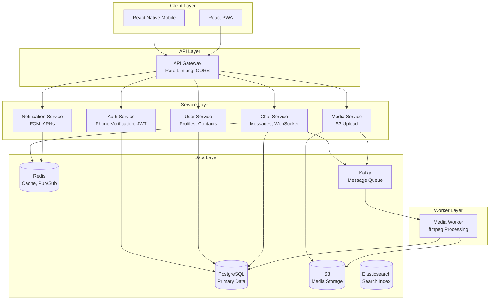
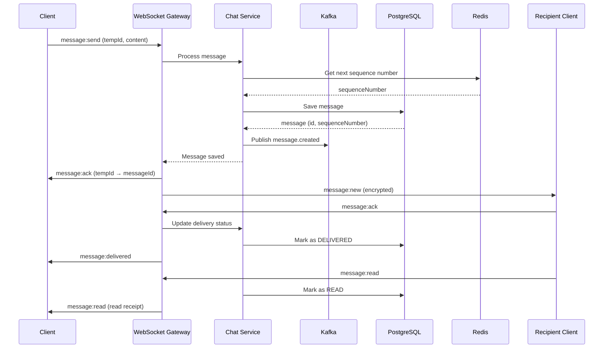
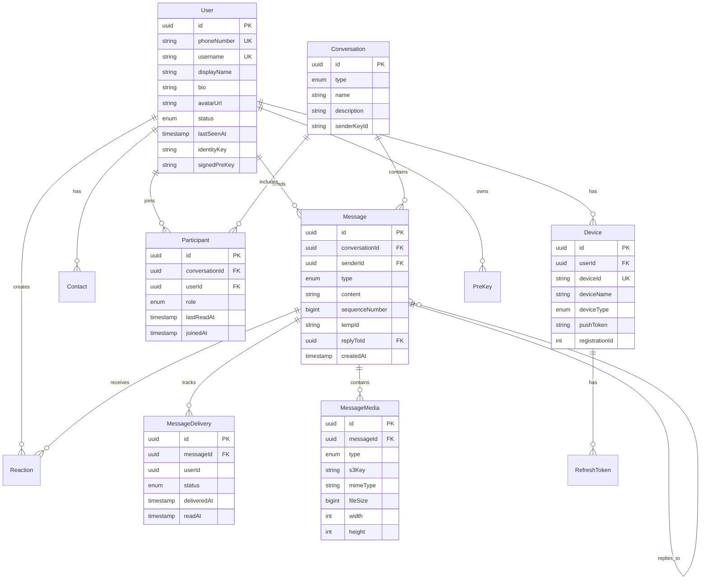
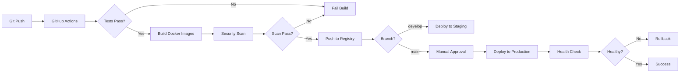

# GearLink - Architecture & System Design

## System Architecture



## Message Flow Sequence



## Data Model (ER Diagram)



## Technology Stack Details

### Backend Services
| Service | Port | Technology | Purpose |
|---------|------|------------|---------|
| API Gateway | 3000 | NestJS | HTTP routing, rate limiting, CORS |
| Auth Service | 3001 | NestJS + Twilio | Phone verification, JWT tokens |
| User Service | 3002 | NestJS | User profiles, contacts, settings |
| Chat Service | 3003 | NestJS | Message persistence, conversations |
| WebSocket | 3004 | Socket.IO | Real-time messaging |
| Media Service | 3005 | NestJS + AWS SDK | S3 presigned URLs |
| Notification Service | 3006 | NestJS + FCM/APNs | Push notifications |
| Media Worker | - | BullMQ + ffmpeg | Background media processing |

### Infrastructure Components
| Component | Technology | Purpose |
|-----------|------------|---------|
| Database | PostgreSQL 15 | Primary data store |
| Cache | Redis 7 Cluster | Caching, Pub/Sub, presence |
| Message Queue | Kafka 3.x | Event streaming |
| Search | Elasticsearch 8.x | Full-text search |
| Storage | AWS S3 | Media files |
| CDN | CloudFront | Media delivery |
| Monitoring | Prometheus + Grafana | Metrics and dashboards |
| Logging | Loki + Grafana | Log aggregation |
| Orchestration | Kubernetes + Helm | Container orchestration |
| IaC | Terraform | Infrastructure provisioning |

## Security Architecture

### End-to-End Encryption (E2EE)

**Protocol**: Signal Protocol (X3DH + Double Ratchet)

**Key Management Flow**:
1. **Identity Key**: Long-term key pair (Ed25519)
2. **Signed Pre-Key**: Medium-term key signed by identity key
3. **One-Time Pre-Keys**: Single-use keys for perfect forward secrecy

**Session Establishment (X3DH)**:
```
Alice wants to message Bob:
1. Alice fetches Bob's public keys from server:
   - Identity Key (IK_B)
   - Signed Pre-Key (SPK_B)
   - One-Time Pre-Key (OPK_B)
2. Alice performs X3DH:
   DH1 = DH(IK_A, SPK_B)
   DH2 = DH(EK_A, IK_B)
   DH3 = DH(EK_A, SPK_B)
   DH4 = DH(EK_A, OPK_B)
   SK = KDF(DH1 || DH2 || DH3 || DH4)
3. Alice sends initial message with ephemeral key
4. Bob receives and establishes session
```

**Double Ratchet**:
- Symmetric-key ratchet: Updates chain keys with each message
- Diffie-Hellman ratchet: Updates root key with each DH exchange
- Provides forward secrecy and break-in recovery

**Group Chats (Sender Keys)**:
- Each sender has a unique sender key for the group
- Sender key rotated when member leaves
- More efficient than pairwise encryption

**Implementation**:
```typescript
// libs/crypto/src/signal.service.ts
import { SignalProtocolStore, SessionBuilder, SessionCipher } from '@privacyresearch/libsignal-protocol-typescript';

export class E2EEService {
  async establishSession(recipientId: string, bundle: PreKeyBundle) {
    const address = new SignalProtocolAddress(recipientId, 1);
    const sessionBuilder = new SessionBuilder(store, address);
    await sessionBuilder.processPreKey(bundle);
  }

  async encryptMessage(recipientId: string, plaintext: string) {
    const address = new SignalProtocolAddress(recipientId, 1);
    const sessionCipher = new SessionCipher(store, address);
    const ciphertext = await sessionCipher.encrypt(Buffer.from(plaintext));
    return ciphertext;
  }

  async decryptMessage(senderId: string, ciphertext: any) {
    const address = new SignalProtocolAddress(senderId, 1);
    const sessionCipher = new SessionCipher(store, address);
    const plaintext = await sessionCipher.decryptPreKeyWhisperMessage(ciphertext);
    return plaintext.toString();
  }
}
```

### Authentication & Authorization

**JWT Structure**:
```json
{
  "sub": "user-uuid",
  "deviceId": "device-uuid",
  "iat": 1234567890,
  "exp": 1234568790,
  "iss": "gearlink",
  "aud": "gearlink-app"
}
```

**Token Lifecycle**:
- Access Token: 15 minutes (short-lived)
- Refresh Token: 7 days (stored in DB, rotated on use)
- Device-based sessions (multiple devices per user)

**Security Measures**:
- Refresh token rotation (invalidate old token on refresh)
- Device fingerprinting
- Rate limiting (30 msg/sec per user)
- CORS whitelist
- CSP headers
- TLS 1.3 only
- HSTS enabled

## Scalability & Performance

### Horizontal Scaling

**Stateless Services**:
- All backend services are stateless
- Can scale independently with HPA (Horizontal Pod Autoscaler)
- Session state in Redis

**WebSocket Scaling**:
- Socket.IO with Redis adapter
- Sticky sessions via load balancer
- Multiple WebSocket instances share state via Redis Pub/Sub

**Database Scaling**:
- Read replicas for read-heavy operations
- Connection pooling (PgBouncer)
- Sharding strategy: By user ID hash (future)

**Caching Strategy**:
```
L1: Application memory (Node.js cache)
L2: Redis (distributed cache)
L3: PostgreSQL (source of truth)
```

### Performance Targets

| Metric | Target | Measurement |
|--------|--------|-------------|
| Message delivery latency (p95) | < 500ms | End-to-end |
| Message delivery latency (p99) | < 1s | End-to-end |
| API response time (p95) | < 200ms | HTTP requests |
| WebSocket connection capacity | 10k per instance | Concurrent connections |
| Message throughput | 1000 msg/sec | Per conversation |
| Database query time (p95) | < 50ms | PostgreSQL |
| Cache hit rate | > 80% | Redis |

### Load Balancing

```
                    [CloudFlare DDoS Protection]
                              |
                    [AWS ALB / NLB]
                       /          \
              [API Gateway]    [WebSocket Cluster]
                 /    |    \        /    |    \
            [Auth] [User] [Chat] [WS-1][WS-2][WS-3]
                      |              |
                [PostgreSQL]    [Redis Cluster]
                 /        \
            [Primary]  [Replicas]
```

## Observability

### Metrics (Prometheus)

**Application Metrics**:
```prometheus
# Message metrics
message_send_total{status="success|failed"}
message_send_latency_seconds{quantile="0.5|0.95|0.99"}
message_delivery_latency_seconds{quantile="0.5|0.95|0.99"}
messages_lost_total

# WebSocket metrics
websocket_connections_total
websocket_messages_sent_total
websocket_messages_received_total
websocket_errors_total

# API metrics
http_request_duration_seconds{method, path, status}
http_requests_total{method, path, status}

# Database metrics
db_query_duration_seconds{query_type}
db_connections_active
db_connections_idle

# Cache metrics
cache_hits_total
cache_misses_total
cache_hit_rate
```

### Logging (Structured JSON)

```json
{
  "timestamp": "2024-01-01T12:00:00.000Z",
  "level": "info",
  "service": "chat-service",
  "correlationId": "req-uuid",
  "userId": "user-uuid",
  "action": "message.sent",
  "messageId": "msg-uuid",
  "conversationId": "conv-uuid",
  "latency_ms": 45,
  "metadata": {
    "sequenceNumber": 12345
  }
}
```

### Tracing (Distributed)

- Correlation IDs across services
- OpenTelemetry integration (future)
- Request flow visualization

### Alerting Rules

```yaml
groups:
  - name: gearlink_alerts
    rules:
      - alert: HighMessageLatency
        expr: histogram_quantile(0.95, message_send_latency_seconds) > 1
        for: 5m
        labels:
          severity: warning
        annotations:
          summary: "High message delivery latency"
          
      - alert: MessageLossDetected
        expr: rate(messages_lost_total[5m]) > 0.001
        for: 1m
        labels:
          severity: critical
        annotations:
          summary: "Messages are being lost"
          
      - alert: DatabaseDown
        expr: up{job="postgresql"} == 0
        for: 1m
        labels:
          severity: critical
        annotations:
          summary: "PostgreSQL is down"
```

## Deployment Strategy

### CI/CD Pipeline



### Kubernetes Deployment

**Namespace Structure**:
- `gearlink-prod`: Production environment
- `gearlink-staging`: Staging environment
- `gearlink-dev`: Development environment

**Resource Limits**:
```yaml
resources:
  requests:
    cpu: 100m
    memory: 256Mi
  limits:
    cpu: 500m
    memory: 512Mi
```

**Autoscaling**:
```yaml
apiVersion: autoscaling/v2
kind: HorizontalPodAutoscaler
metadata:
  name: chat-service
spec:
  scaleTargetRef:
    apiVersion: apps/v1
    kind: Deployment
    name: chat-service
  minReplicas: 3
  maxReplicas: 10
  metrics:
    - type: Resource
      resource:
        name: cpu
        target:
          type: Utilization
          averageUtilization: 70
```

### Blue-Green Deployment

1. Deploy new version (green) alongside current (blue)
2. Run smoke tests on green
3. Gradually shift traffic (10% → 50% → 100%)
4. Monitor metrics
5. If issues: instant rollback to blue
6. If success: decommission blue

## GDPR Compliance

### Data Subject Rights

| Right | Implementation |
|-------|----------------|
| Right to Access | API endpoint to export all user data |
| Right to Rectification | Update profile endpoints |
| Right to Erasure | Soft delete → Hard delete after 30 days |
| Right to Portability | JSON export of all data |
| Right to Restrict Processing | Account suspension |

### Data Retention

```typescript
// Retention policy
const RETENTION_POLICY = {
  messages: '1 year',
  media: '1 year',
  audit_logs: '7 years',
  deleted_accounts: '30 days (soft delete)',
};

// Automated cleanup job
@Cron('0 2 * * *') // Daily at 2 AM
async cleanupOldData() {
  const oneYearAgo = new Date();
  oneYearAgo.setFullYear(oneYearAgo.getFullYear() - 1);
  
  // Delete old messages
  await this.prisma.message.deleteMany({
    where: {
      createdAt: { lt: oneYearAgo },
      deletedAt: { not: null },
    },
  });
  
  // Hard delete soft-deleted accounts after 30 days
  const thirtyDaysAgo = new Date();
  thirtyDaysAgo.setDate(thirtyDaysAgo.getDate() - 30);
  
  await this.prisma.user.deleteMany({
    where: {
      status: 'DELETED',
      updatedAt: { lt: thirtyDaysAgo },
    },
  });
}
```

### Audit Logging

All sensitive operations logged:
- User authentication
- Message deletion
- Account deletion
- Privacy setting changes
- Admin actions

## Disaster Recovery

### Backup Strategy

**Database**:
- Automated daily backups (AWS RDS)
- Point-in-time recovery (35 days)
- Cross-region replication

**Media**:
- S3 versioning enabled
- S3 Cross-Region Replication
- Lifecycle policies (archive to Glacier after 1 year)

**Recovery Time Objective (RTO)**: 1 hour
**Recovery Point Objective (RPO)**: 5 minutes

### Incident Response

1. **Detection**: Automated alerts
2. **Assessment**: On-call engineer investigates
3. **Containment**: Isolate affected components
4. **Recovery**: Restore from backup or rollback
5. **Post-Mortem**: Document and improve

---

## Quick Start Commands

```bash
# Setup
pnpm install
docker-compose up -d
pnpm prisma:migrate
pnpm prisma:seed

# Development
pnpm dev:all

# Testing
pnpm test
pnpm test:e2e
pnpm test:load

# Production Build
pnpm build:all
pnpm docker:build
pnpm docker:push

# Deploy
kubectl apply -f infra/k8s/
helm install gearlink ./infra/k8s/charts/gearlink
```
